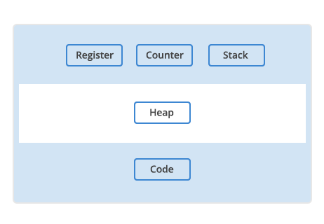
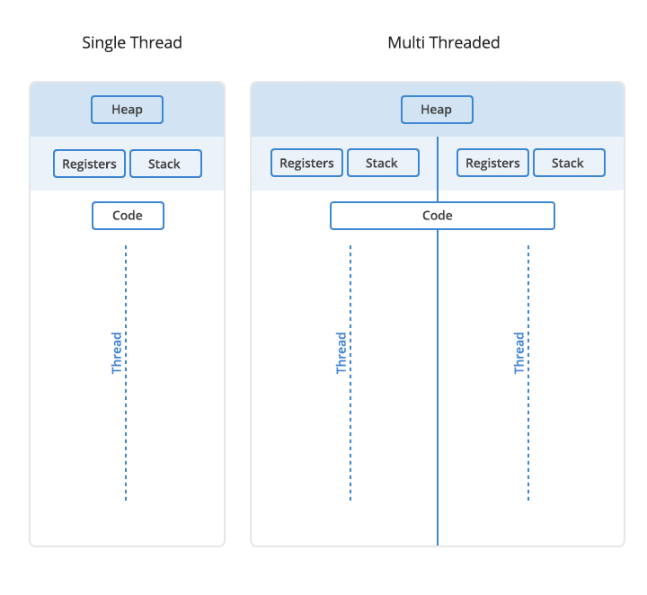
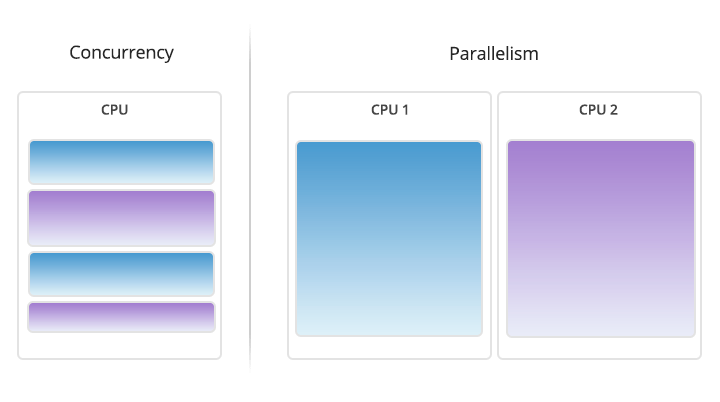
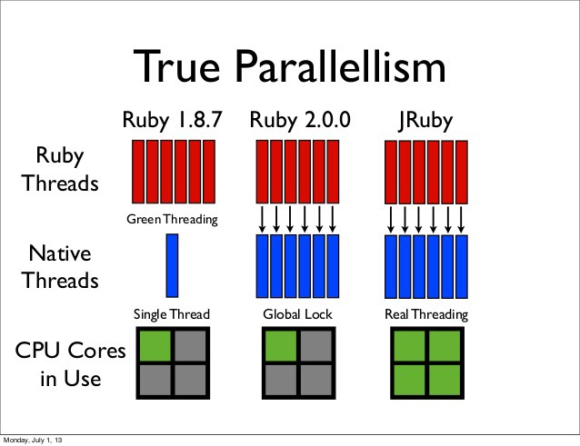
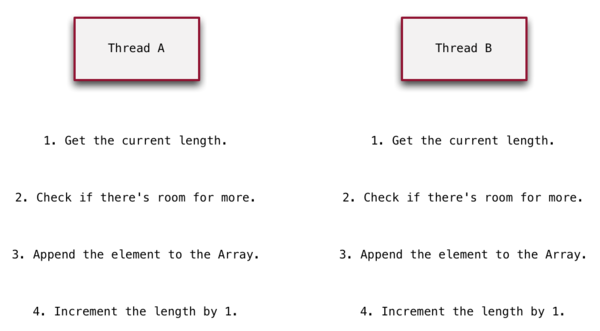
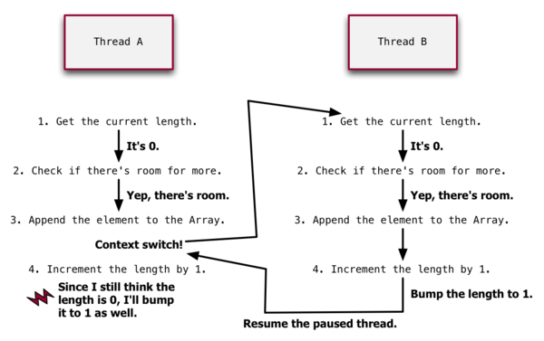

# Ruby Concurrency


## What is a program?

How does a computer execute your commands? Whatever language you choose, your code is finally translated into i/o (0 and 1) which computer can understand

This translation and output form are what you call compiling and binary file(or form).


Computer runs binary code using some resources:

* **Memory:** storage for current program CPU is handling(located outside CPU)
* **Registers:** short-term storage of the data and transfer them from one component to another
* **Stack:** linear LIFO data structure, containing temporary information. e.g. Local variables, return addresses, etc.
* **Counter:** a register indicating the next instruction
* **Heap:** allocating memory to a process at run time


## Process

A process is an instance of a computer program containing binary code along with the resources above.

And a thread is a component of a process. It is an execution unit and it contains program counter, stack and set of registers.





There can be multiple instances of a single program, and each instance of that running program is a process. Each process has a separate memory address space, which means that a process runs independently and is isolated from other processes. It cannot directly access shared data in other processes. Switching from one process to another requires some time (relatively) for saving and loading registers, memory maps, and other resources.


## Thread

A thread is the unit of execution within a process. A process can have anywhere from just one thread to many threads.





We talked about the two types of memory available to a process or a thread, the stack and the heap. It is **important** to distinguish between these two types of process memory because each thread will have its own stack, but all the threads in a process will share the heap.

### Level threads

* **User level:**
  * User thread are implemented by users.
  * OS doesn’t recognized user level threads.	
  * Implementation of User threads is easy.	
  * Context switch time is less.
  * Context switch requires no hardware support.	
  * If one user level thread perform blocking operation then entire process will be blocked.	
  * User level threads are designed as dependent threads.	
* **Kernel level:**
  * kernel threads are implemented by OS.
  * Kernel threads are recognized by OS.
  * Implementation of Kernel thread is complicated.
  * Context switch time is more.
  * Hardware support is needed.
  * If one kernel thread perform blocking operation then another thread can continue execution.
  * Kernel level threads are designed as independent threads.


## Concurrency vs parallelism

There are similar concepts named concurrency and parallelism.

**Parallelism:** two tasks literally run at the same time
**Concurrency:** two tasks can be ‘in progress’ at the same time
Concurrency is a little tricky, but the main difference is that in concurrency there is always only one task that is actually running.



### Native Threads vs Green Threads

Your code can spawn multiple threads at runtime that don’t directly map to threads that execute on multiple cores as the OS level. These are known as “Green Threads”, and allow us to achieve concurrency in our programs whilst avoiding parallelism.


The difference between the two is that the kernel knows about native threads, but it doesn’t know about green threads. In other words, if your program is using only green threads it’s still a single threaded program from the kernel’s perspective. All of the thread creation, destruction, and scheduling takes place within your process (i.e. in user space) and is therefore hidden from the kernel.

## The GIL and MRI

MRI allows concurrent execution of Ruby code, but prevents parallel execution of Ruby code.

The GIL ensures us that only a single thread can execute at a time, even if run on a multi-core processor. See the diagram on True Parallelism above. The GIL is just one giant lock which will prevent multiple threads from running on the OS at the same time.


Ruby MRI will switch context when you call a method or return from a method. What exactly does this mean?

When threads switch context, a thread is stopped and it’s state and context are stored and other threads are then allowed to use the available CPU cycles.



Whenever the interpreter decides to context-switch between threads, the following three steps must all happen (in the given order):

* The current thread has to release the GIL.
* The scheduler has to select the next thread.
* The new thread has to acquire the GIL.

All three of these steps are happening behind scenes and cannot be influenced by your Ruby code. The interesting thing here is, that the GIL has to be released voluntarily by the current thread (which is what makes the threading model cooperative). This implies that the context-switch has to be initiated by the current thread. But how does the current thread decide when a context-switch should happen?

While the interpreter is executing your Ruby code, it’s continuously checking a boolean flag indicating whether a context-switch should happen or not. If the flag is true, it’s initiating the context-switch after which the flag is reset to false.


## Thread Context Switching

The context switch comes from the operating system thread schedule.

The operating system has to ensure that no single thread can hog all of the available resources, like CPU time, so it implements scheduling so that each thread has fair access to the resources.

This manifests as a series of pauses and resumes. Each thread gets a turn to consume resources, then it's paused in its tracks so another thread can have a turn. In time, this thread will be resumed, on and on again.

### The timer thread

I said that the timer thread is what keeps one thread from hogging the GIL. 

The timer thread is just a native thread that exists internally in MRI; it has no equivalent Ruby thread. The timer thread is started up when MRI starts up.

This timer thread is what keeps a thread from hogging the GIL. Every 100ms, the timer thread sets an interrupt flag on the thread currently holding the GIL

### Recognizing race conditions

Remember that a context switch can occur on any line of your code. When switching from one thread to another, imagine your program being chopped up into a set of discrete blocks. This sequential set of blocks is a set of interleavings.

At one end of the spectrum, it's possible that there's a context switch after every line of code!. At the other end of the spectrum, it's possible that there are no context switches during the body of the thread.







### GIL guarantees


### Thread States

In Ruby, there are five states available for threads which show the status of the thread. You can check the status of a thread by using alive? and status methods.

* **Runnable:** The thread which is currently running or that is ready to take CPU resources when they are available.
* **Sleeping:** The thread which is currently sleeping, or that is waiting for IO, or that is stopped itself.
* **Aborting:** It is a intermediate state. An aborting thread in which it has been killed, but that has not yet terminated.
* **Terminated with exception:** A thread contains exception, or in other words a thread which is terminated due to the rise of exception.
* **Terminated normally:** The thread which terminates normally, or that does not contain an exception and completed its work.


### Race Conditions and Other Hazards

#### Lazy initialization

That lazy initialization is another form of the the check-then-set race condition. The ||= operator effectively expands to

```ruby

@logger ||= Logger.new

# expands to 

if @logger == nil
  @logger = Logger.new
end

@logger
```

#### Dead Lock

Is when all the processes do not get access to resources because every process is waiting for some another process and there is a cycle.

e.g.

* DB connection pool

* Dead lock of 2 accounts

Stackoverflow

#### Live Lock

is similar to a deadlock, except that the states of the processes involved in the livelock constantly change with regard to one another, none progressing. 

e.g.

A real-world example of livelock occurs when two people meet in a narrow corridor, and each tries to be polite by moving aside to let the other pass, but they end up swaying from side to side without making any progress because they both repeatedly move the same way at the same time.

#### Starvation

Starvation is a situation where all the low priority processes got blocked, and the high priority processes proceed. In any system, requests for high/low priority resources keep on happening dynamically. Thereby, some policy is require to decide who gets support when.

Using some algorithms, some processes may not get the desired serviced even though they are not deadlocked. Starvation occurs when some threads make shared resources unavailable for a long period of time.

Example of Starvation:

For example, an object offers a synchronized method which likely to take a long time to return. If one thread uses this method frequently, other threads that also need frequent synchronized access to the same object will often be blocked.


### Atomicity

Is one of the key concepts in multi-threaded programs. We say a set of actions is atomic if they all execute as a single operation, in an indivisible manner.

Native objects in ruby for atomicity:

* Mutex
* Queue


## Fibers

### Generators

### Resumable computations

### Non blocking IO

## Results


export _JAVA_OPTIONS="-Dhttps.protocols=SSLv3,TLSv1.3,TLSv1.2,TLSv1.1,TLSv1 -Djdk.tls.client.protocols=SSLv3,TLSv1.3,TLSv1.2,TLSv1.1,TLSv1 -Dawt.useSystemAAFontSettings=on -Dswing.aatext=true" # -Djavax.net.debug=all
asdf global ruby 2.7.1
asdf global ruby truffleruby-20.1.0
asdf global ruby jruby-9.2.11.1

### Sequential

total --> 500

real    7m21.610s
user    0m2.881s
sys     0m0.441s

### Threads

total --> 500

real    1m13.006s
user    0m2.740s
sys     0m0.551s


## Resources

* https://www.youtube.com/watch?v=rOHIDzMdITE
* https://www.youtube.com/watch?v=qKQcUDEo-ZI
* https://www.youtube.com/watch?v=8XRcOZXOzV4
* https://blog.kiprosh.com/ruby-fibers/
* https://pragdave.me/blog/2007/12/30/pipelines-using-fibers-in-ruby-19.html
* https://blog.monotone.dev/ruby/2020/01/20/event-driven-with-ruby-fiber.html
* https://medium.com/@neektza/concurrency-primitives-and-abstractions-in-ruby-aae5b5354247
* https://www.youtube.com/watch?v=x7NYf9xughk
* https://www.youtube.com/watch?v=fK-N_VxdW7g
* https://www.unf.edu/public/cop4610/ree/Notes/PPT/PPT8E/CH%2006%20-OS8e.pdf
* https://www.tutorialspoint.com/starvation-and-deadlock
* https://www.guru99.com/what-is-livelock-example.html
* https://stackoverflow.com/questions/1036364/good-example-of-livelock
* https://eregon.me/blog/2017/12/28/thread-report-on-exception.html
* http://blog.ifyouseewendy.com/blog/2016/02/16/review-working-with-ruby-threads/
* https://dev.to/enether/working-with-multithreaded-ruby-part-ii-5e3
* https://github.com/jruby/jruby/wiki/concurrency-in-jruby
* https://medium.com/better-programming/multithreaded-ruby-synchronization-race-conditions-and-deadlocks-f1f1a7cddcea
* https://www.geeksforgeeks.org/ruby-thread-life-cycle-its-states/
* https://www.ruby.or.jp/grant/2018/grant2018-concurrent-ruby-mentor.pdf
* https://medium.com/@WesleyDavis/multi-threading-in-ruby-1c075f4c7410
* https://medium.com/@adrianbooth/exploring-rubys-multi-threaded-weirdness-d5dc61883591
* https://github.com/grosser/parallel
* https://github.com/chadrem/workers
* https://github.com/ruby-concurrency/concurrent-ruby
* https://ruby-hacking-guide.github.io/thread.html
* https://blazarblogs.wordpress.com/2019/08/20/how-threads-work-in-ruby/
* https://www.backblaze.com/blog/whats-the-diff-programs-processes-and-threads/
* https://medium.com/@yutafujii_59175/multi-thread-and-multi-process-5559ea5b19ba
* https://www.jstorimer.com/blogs/workingwithcode/8085491-nobody-understands-the-gil
* https://www.jstorimer.com/blogs/workingwithcode/8100871-nobody-understands-the-gil-part-2-implementation
* http://www.rubyinside.com/does-the-gil-make-your-ruby-code-thread-safe-6051.html
* http://underpop.online.fr/j/java/help/thread-scheduling-network-dev-java-programming-language.html.gz
