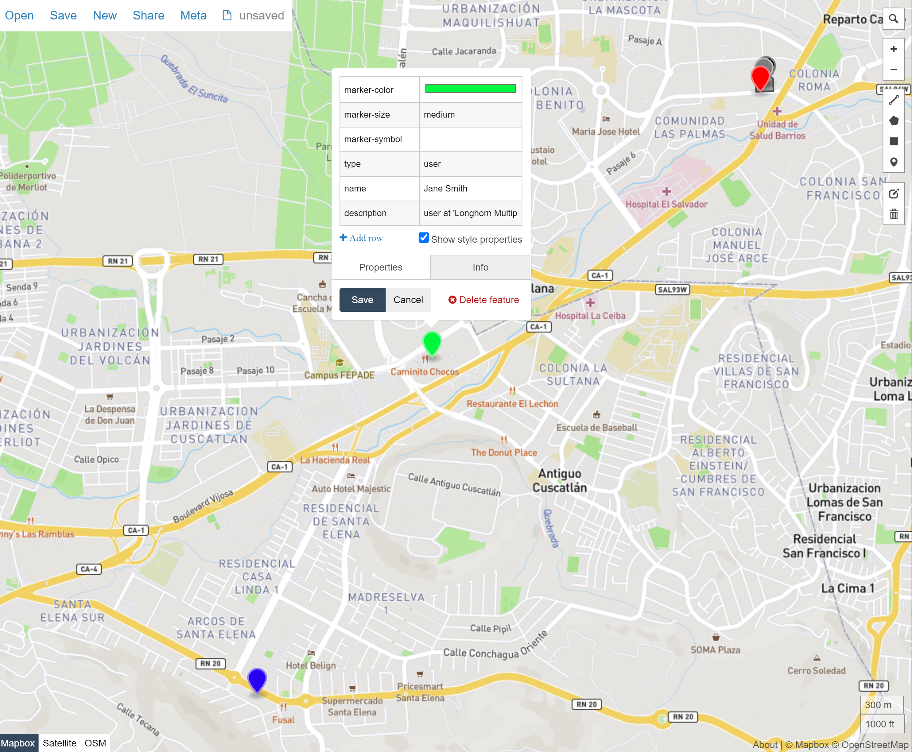

## Postgis demo

### Install the postgis activerecord adapter

```ruby
# add it to the Gemfile
bundle add activerecord-postgis-adapter
```

## Postgres

### Docker image 

Postgres image will not work for us this time, we have to change it for the `postgis`

### Check available extensions

In case we are using a RDS or another cloud db, we can cehck the list of available extension by using

```
select * from pg_available_extensions where name like '%postgis%';
```

### Check enabled extensions

```
select * from pg_extension
```

## Project

For this project we are going to use the next map with the following poits:



The geojson data is located at `san-benito-plaza.json` and consists of:

* 3 users:
  * Richard Tea (black)
  * John Doe (red)
  * Jane Smith (green)
  * Barry Tone
* 1 place:
  * San Benito plaza (marker)
  * San Benito plaza - area (polygon)


### Tables

* Locations (places) `postgis/demo/db/migrate/20201208162434_create_locations.rb`
* Users `postgis/demo/db/migrate/20201209024803_create_users.rb`


### Import data to the postgres

```bash
# Enter to the container 
docker-compose exec web bash
# Run the task to import
bundle exec rails imports:import_geodata 
```

## Console

```bash
# Enter to the container 
docker-compose exec web bash

# Enter to the rails console
bundle exec rails c
```

```ruby
# Find Jhon Doe near 50 meters from the San Benito plaza, just outside the plaza
Location.within(User.john.coords, 50)

# Find Jane Smith near 2505 meters from the San Benito plaza, at Longhorn restaurant
Location.within(User.jane.coords, 2505)

# Find Barry Tone near 2505 meters from the San Benito plaza, at La Pampa Argentina restaurant
Location.within(User.barry.coords, 4615)

# Find users (Richard Tea) that are inside of the area (polygon) of the San Benito plaza

User.within_polygon(Location.plaza_san_benito.area)

# Shortest distance from the San Benito plaza to the user ( Barry Tone - 4614.48848128 meters)
Location.plaza_san_benito.distance_from(User.barry.coords)

```