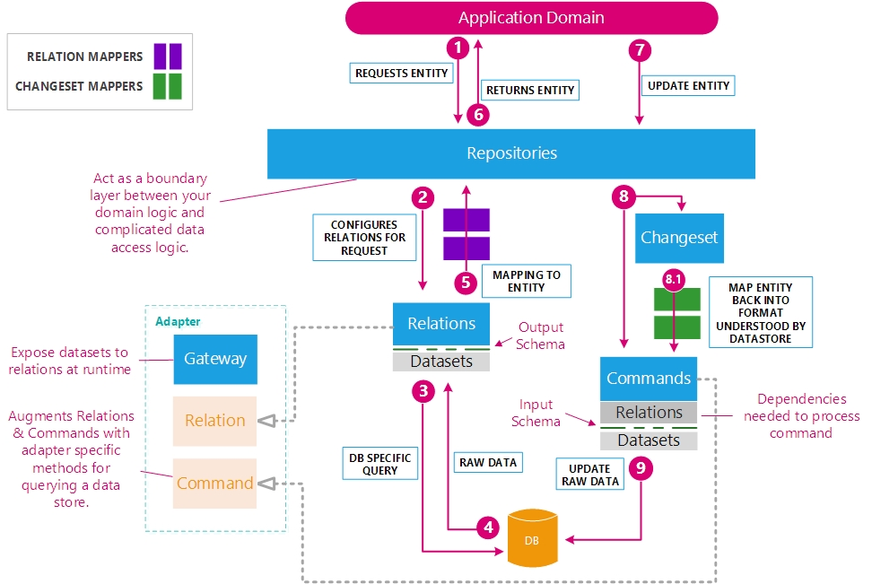

# Ruby Object Mapper


Ruby Object Mapper is an open-source persistence and mapping toolkit for Ruby built for speed and simplicity.




* [Core Concepts](https://rom-rb.org/learn/introduction/core-concepts/)

---

## Project setup

### Installing Gems

**Create Gemfile***

```ruby
source 'https://rubygems.org'

ruby '2.7.0'

gem 'dry-system'
gem 'rom'
gem 'rom-sql'
gem 'pg'

gem 'dotenv'
gem 'rake'
gem 'pry'
gem 'dry-auto_inject'
```

### Boot Configuration


`config/boot.rb`

```ruby
APP_ROOT = File.expand_path('../../', __FILE__)

ENV['APP_ENV'] ||= "development"

ENV['BUNDLE_GEMFILE'] ||= File.join(APP_ROOT, '/', 'Gemfile')

require "bundler"
Bundler.require(:default, ENV["APP_ENV"])


require "dotenv"
Dotenv.load(".env", ".env.#{ENV["APP_ENV"]}")

require 'securerandom'
```

### Application Environment Setup

`config/application.rb`

```ruby
require_relative "boot"

require "dry/system/container"

module Demo
  class Application < Dry::System::Container
    configure do |config|
      config.root = File.expand_path('..', __dir__)
      config.default_namespace = 'demo'

      config.auto_register = 'lib'
    end

    load_paths!('lib')
  end
  Import = Dry::AutoInject(Application)
end
```

### Application boot

`system/boot/db.rb`

```ruby
Demo::Application.boot(:db) do
  init do
    require "rom"
    require "rom-sql"

    register('db.config', ROM::Configuration.new(:sql, ENV['DATABASE_URL']))
  end
end
```

### Persistance boot

`system/boot/persistence.rb`

```ruby
Demo::Application.boot(:persistence) do |app|
  start do
    config = app['db.config']
    config.auto_registration(app.root + "lib/demo")
    register('container', ROM.container(app['db.config']))
  end
end
```


### Create Rakefile

```ruby
require_relative 'config/application'
require 'rom-sql'
require 'rom/sql/rake_task'

namespace :db do
  task :setup do
    Demo::Application.start(:db)
    ROM::SQL::RakeSupport.env = ROM.container(Demo::Application['db.config']) do |config|
      config.gateways[:default].use_logger(Logger.new($stdout))
    end
  end
end
```

### Migrations

Like a lot of database frameworks, ROM also comes with migrations. We can use these to create the tables for our application.

You can the information to create migrations here, https://github.com/jeremyevans/sequel/blob/master/doc/schema_modification.rdoc.


**Contacts**

```ruby
rake db:create_migration[create_contacts]
```

```ruby
# frozen_string_literal: true

ROM::SQL.migration do
  change do
    create_table :contacts do
      primary_key :id
      column :uuid, String, null: false, unique: true
      column :name, String, null: false, index: true
      column :starred, TrueClass, default: false
      column :created_at, DateTime, null: false
      column :updated_at, DateTime, null: false
      check{char_length(name) < 96}
    end
  end
end
```

**Addresses**

```ruby
rake db:create_migration[create_addresses]
```

```ruby
# frozen_string_literal: true

ROM::SQL.migration do
  change do
    create_table :addresses do
      primary_key :id
      foreign_key :contact_id, :contacts
      column :uuid, String, null: false, unique: true
      column :description, String, null: false, index: true
      column :created_at, DateTime, null: false
      column :updated_at, DateTime, null: false
    end
  end
end
```

**Phones**

```ruby
rake db:create_migration[create_phones]
```

```ruby
# frozen_string_literal: true

ROM::SQL.migration do
  change do
    create_table :phones do
      primary_key :id
      foreign_key :contact_id, :contacts
      column :uuid, String, null: false, unique: true
      column :number, String, null: false, index: true
      column :created_at, DateTime, null: false
      column :updated_at, DateTime, null: false
    end
  end
end
```

**Phones**

```ruby
rake db:create_migration[create_emails]
```

```ruby
# frozen_string_literal: true

ROM::SQL.migration do
  change do
    create_table :emails do
      primary_key :id
      foreign_key :contact_id, :contacts
      column :uuid, String, null: false, unique: true
      column :account, String, null: false, index: true
      column :created_at, DateTime, null: false
      column :updated_at, DateTime, null: false
    end
  end
end
```

### Run Migrations


`rake db:migrate`

### Creaate console

```bash
mkdir bin

cat <<EOF > bin/console
#!/usr/bin/env ruby
require_relative '../config/application'

Demo::Application.finalize!

Pry.start
EOF

chmod +x bin/console
```

### Relations

A relation class is used to represent data returning from a database, and is used most often by the repository itself. If we had a need for complex methods for working with data, they would go in "messy" relation methods, and then the repository would call those methods.


**Contacts**

`lib/demo/relations/contacts.rb`

```ruby
module Demo
  module Relations
    class Contacts < ROM::Relation[:sql]
      schema(:contacts, infer: true) do
        associations do
          has_many :emails
          has_many :phones
          has_many :addresses
        end
      end

      def sorted
        order(:name)
      end

      def starred
        where(starred: true).order(:name)
      end
    end
  end
end
```

**Addresses**

`lib/demo/relations/addresses.rb`

```ruby
module Demo
  module Relations
    class Addresses < ROM::Relation[:sql]
      schema(:addresses, infer: true) do
        associations do
          belongs_to :contact
        end
      end
    end
  end
end
```

**Emails**

`lib/demo/relations/emails.rb`

```ruby
module Demo
  module Relations
    class Emails < ROM::Relation[:sql]
      schema(:emails, infer: true) do
        associations do
          belongs_to :contact
        end
      end
    end
  end
end
```

**Phones**

`lib/demo/relations/phones.rb`

```ruby
module Demo
  module Relations
    class Phones < ROM::Relation[:sql]
      schema(:phones, infer: true) do
        associations do
          belongs_to :contact
        end
      end
    end
  end
end
```

### Repositories

In order to get data into and out of database tables with ROM, we need to create something called a repository. A repository is a class that is used to define a clear API between your database and your application.

**Contacts**

`lib/demo/repos/contact_repo.rb`

```ruby
module Demo
  module Repos
    class ContactRepo < ROM::Repository[:contacts]
      include Import["container"]

      commands :create,
        use: :timestamps,
        plugins_options: {
          timestamps: {
            timestamps: %i(created_at updated_at)
          }
        }

      def all
        contacts.to_a
      end

      def starred_and_sorted
        contacts.starred.sorted
      end

      def create_with_phones(contact)
        contacts.combine(:phones).command(:create, use: :timestamps,
          plugins_options: {
            timestamps: {
              timestamps: %i(created_at updated_at)
            }
          }
        ).call(contact)
      end
    end
  end
end
```

**Phones**

`lib/demo/repos/phone_repo.rb`

```ruby
module Demo
  module Repos
    class PhoneRepo < ROM::Repository[:phones]
      include Import["container"]

      commands :create,
        use: :timestamps,
        plugins_options: {
          timestamps: {
            timestamps: %i(created_at updated_at)
          }
        }
    end
  end
end
```

**Emails**

`lib/demo/repos/email_repo.rb`

```ruby
module Demo
  module Repos
    class EmailRepo < ROM::Repository[:emails]
      include Import["container"]

      commands :create,
        use: :timestamps,
        plugins_options: {
          timestamps: {
            timestamps: %i(created_at updated_at)
          }
        }
    end
  end
end
```

**Addresses**

`lib/demo/repos/email_repo.rb`

```ruby
module Demo
  module Repos
    class AddressRepo < ROM::Repository[:addresses]
      include Import["container"]

      commands :create,
        use: :timestamps,
        plugins_options: {
          timestamps: {
            timestamps: %i(created_at updated_at)
          }
        }
    end
  end
end
```


### Try it!

## Run services

In another terminal run `docker-compose up`

## Run app container

To enter the container app, run `docker-compose run  console bash`


### Start the REPL

```bash
bin/console
```

### Play with the app

```ruby
# Create Records

contact_repo = Demo::Repos::ContactRepo.new() # otherwise Demo::Repos::ContactRepo.new(Demo::Application['container'])

john = contact_repo.create(name: "John Doe", uuid: SecureRandom.uuid)
jane = contact_repo.create(name: "Jane Doe", uuid: SecureRandom.uuid, starred: true)

# Create with nested association

joe = contact_repo.create_with_phones(
  name: "Joe Smith",
  uuid: SecureRandom.uuid,
  phones: [
    { 
      number: "+50322577777",
      uuid: SecureRandom.uuid,
    }
  ]
)


# Select only the starred contacts and sorted by name

contacts = Demo::Application['container'].relations[:contacts].starred.sorted

contacts = contact_repo.starred_and_sorted

# Get connection

connection = Demo::Application['container'].gateways[:default].connection

```


## Resources

* [How to setup Ruby Object Mapper (ROM) for standalone project](https://medium.com/@igkuz/how-to-setup-ruby-object-mapper-rom-for-standalone-project-15472fcf31e1)
* [ROM + Dry Showcase: Part 1 - Application + Database setup](https://ryanbigg.com/2020/02/rom-and-dry-showcase-part-1)
* [Sequel Schema doc](https://github.com/jeremyevans/sequel/blob/master/doc/schema_modification.rdoc)
* [A conversational introduction to rom-rb](http://icelab.github.io/conversational-intro-to-rom-rb/part-1.html)