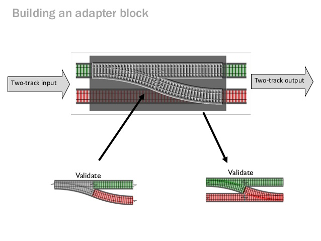
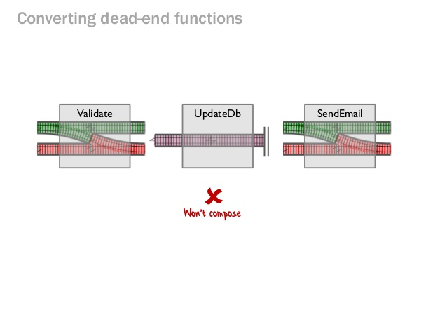
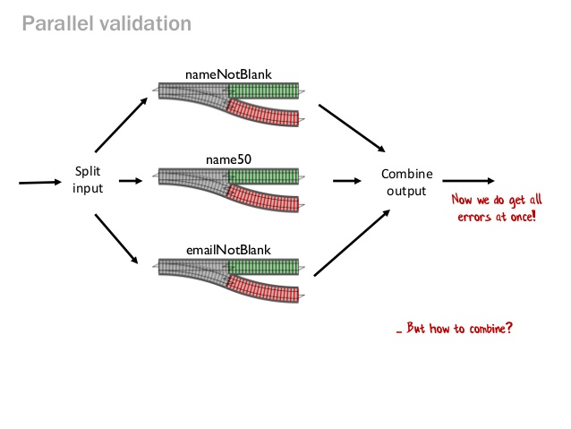

# Trailblazer

Trailblazer is an architectural style that provides a modern approach to implementing business logic.

It makes complex application workflows simple, reliable and self-documenting.

## Monads

Monads are data types that wrap values of any other types and provide a structured way of executing a sequence of functions on those wrapped values, without any additional boilerplate.

## Railway Basics

Railway Oriented Programming (ROP) is a functional programming technique that allows sequential execution of functions, not necessarily synchronous. The key concept is that each function can only accept and return Container of either Success or Failure. Failure wraps Throwable type and Success can be of any type.

## Designing Errors

Using strings as errors is not good, is better to use a special type rather than a string.

## Trailblazer Operation

An operation is a service object.

Its goal is simple: Remove all business logic from the controller and model and provide a separate, streamlined object for it.

Operations implement functions of your application, like creating a comment, following a user or exporting a PDF document. Sometimes this is also called command.

Technically, an operation embraces and orchestrates all business logic between the controller dispatch and the persistence layer. This ranges from tasks as finding or creating a model, validating incoming data using a form object to persisting application state using model(s) and dispatching post-processing callbacks or even nested operations.

Note that an operation is not a monolithic god object, but a composition of many stakeholders. It is up to you to orchestrate features like policies, validations or callbacks.

Features: 

* Error handling by using a monad.
* Uses ROP
* Encapsulation of business logic
* Macros
* Policy
* Contract

## Reform

Reform provides form objects to run validations for one or multiple models.

Validations no longer sit in model classes, but in forms. Once the data is coerced and validated, it can be written to the model.

A model can be any kind of Ruby object. Reform is completely framework-agnostic and doesn’t care about your database.

A form doesn’t have to be a UI component, necessarily! It can be an intermediate validation before writing data to the persistence layer. While form objects may be used to render graphical web forms, Reform is used in many pure-API applications for deserialization and validation.

* **API** In Reform, form classes define fields and validations for the input. This input can be validated using validate and written to the model using sync or save. → API
* **DATA TYPES** Reform can map model attributes, compositions of objects, nested models, hash fields and more. → DATA TYPES
* **COERCION** When validating, the form can coerce input to arbitrary values using the dry-types gem. → COERCION
* **POPULATOR** Deserialization of the incoming data can be customized using populators. → POPULATOR
* **VALIDATION GROUPS** Validations can be chained or run when certain criteria match, only. → VALIDATION GROUPS

## Monads types:

**Result (Operation::Result)**: An operation invoked with public call will return an Operation::Result object for your convenience. It’s nothing but a container exposing the binary state (or outcome) plus the ctx object that was passed around in the circuit. The operation ending on a “failure” end (End.failure, End.fail_fast) will result in `result.failure?` being true. All other outcomes will be interpreted as success `result.success?`.

### ARCHITECTURE

* SETUP
* DESERIALIZATION
* POPULATOR
* VIRTUAL OBJECT GRAPH (input)
* VALIDATION
* SYNC/SAVE

## Cell

A cell is an object that represent a fragment of your UI. The scope of that fragment is up to you: it can embrace an entire page, a single comment container in a thread or just an avatar image link.

In other words: A cell is an object that can render a template.

## Representable

Representable maps objects to documents (rendering) and documents to objects (parsing) using representers. Representers define the document structure and the transformation to/from objects.

#### Resources

* https://fsharpforfunandprofit.com/rop/
* https://medium.com/@naveenkumarmuguda/railway-oriented-programming-a-powerful-functional-programming-pattern-ab454e467f31
* https://www.greenbird.com/news/railway-oriented-programming-in-kotlin#:~:text=Railway%20Oriented%20Programming%20(ROP)%20is,can%20be%20of%20any%20type.
* https://vimeo.com/113707214
* https://www.slideshare.net/ScottWlaschin/railway-oriented-programming
* https://www.youtube.com/watch?v=gbcE-qK_190
* https://trailblazer.to/2.1/blog.html
* https://www.2n.pl/blog?tag=trailblazer
* https://medium.com/@baweaver/functional-programming-in-ruby-flow-control-565bbdcdf2a2
* https://fsharpforfunandprofit.com/posts/against-railway-oriented-programming/
* https://blog.primehammer.com/wp-content/uploads/2019/02/ruby-stories-rop-erich.pdf